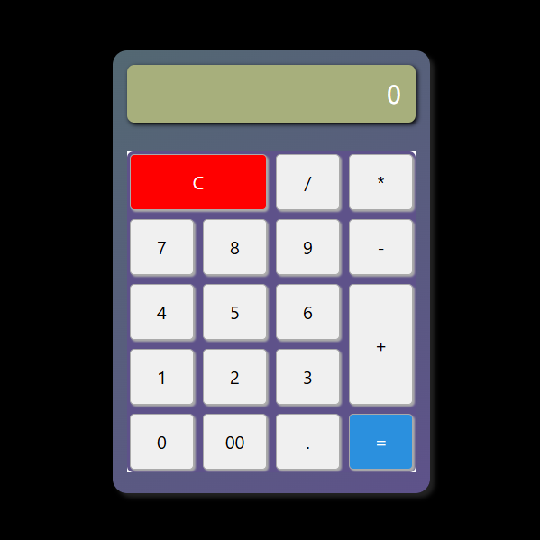

# Streamlit Calculator



## Overview

A simple and interactive calculator built with [Streamlit](https://streamlit.io/) using the [streamlit-grid](https://pypi.org/project/streamlit-grid/) for a responsive and visually appealing grid layout.

## Live Demo
Check out the live version of this Calculator [here](https://calculator8.streamlit.app/).

## Features
- Basic arithmetic operations (+, -, *, /)
- Clear button to reset calculations
- Decimal support
- Interactive grid-based UI

## Installation

To install Mode Tracker, follow these steps:

1. Clone the repository:
    ```bash
    git clone https://github.com/syeda-hoorain-ali/ramzan-coding-nights.git
    ```
2. Navigate to the project directory:
    ```bash
    cd 09-calculator
    ```
3. Create and activate virtual environment:
    ```bash
    uv venv
    ./venv/Scripts/activate
    ```
4. Install the dependencies:
    ```bash
    uv pip install .
    ```

## Usage

To start using Mode Tracker, run the following command:
```bash
streamlit run src/app.py
```


## How It Works
This calculator leverages the `streamlit-grid-component` to create a dynamic grid layout for calculator buttons. The selected values update the equation, and results are displayed in real-time.

## Contributing
Pull requests are welcome! If you find any issues, feel free to open an issue or suggest improvements.

## Acknowledgments
- Built with ❤️ using [Streamlit](https://streamlit.io/)
- Powered by [streamlit-grid-component](https://pypi.org/project/streamlit-grid/) 🚀
