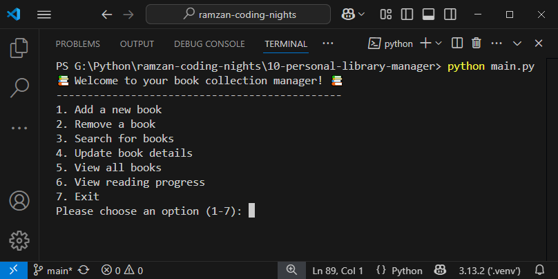

# Personal Library Manager


<br /><br />

# Overview
A Python-based application to manage your personal library. This tool helps you organize, track, and manage your book collection efficiently.

## Features

- Add new books to the library
- Delete books from the library
- Search for books in the library
- Update book information
- Show all books in the library
- Show reading progress

## Usage

1. Clone the repository:
    ```bash
    git clone https://github.com/syedahoorainali/ramzan-coding-nights.git
    ```
2. Navigate to the project directory:
    ```bash
    cd 10-personal-library-manager
    ```
3. Run the application:
    ```bash
    python main.py
    ```
4. Follow the on-screen instructions to manage your library.


## Stylish Version

A more stylish version of this project is available [here](https://github.com/syedahoorainali/python-personal-library-manager).  
This project includes exciting enhancements such as:

- A spinner for better user experience during loading processes.
- Text animations to make the interface more engaging.
- Integration with `pandas` for data visualization, providing insightful views of your library data.
- Upcoming updates will introduce vibrant colorful text to further enhance the visual appeal.

## Contributing
Contributions are welcome! Please fork the repository and submit a pull request.

## License
This project is licensed under the [MIT License](LICENSE).
